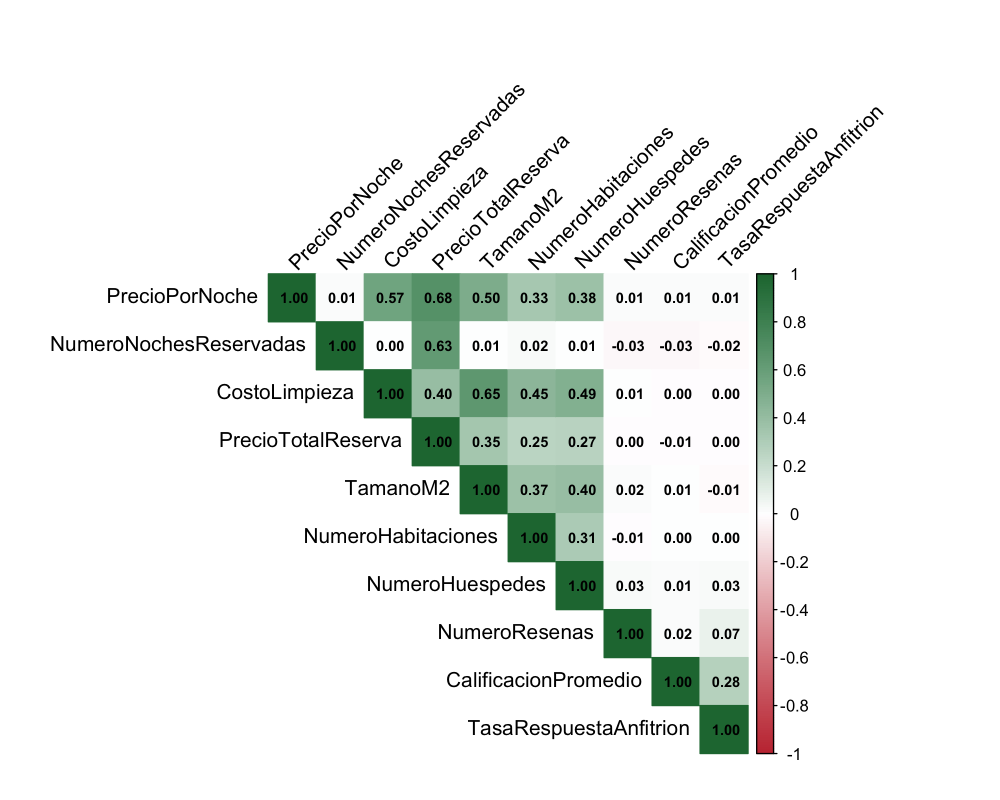

```{r setup}
#| include: false
source("R/03_graficos.R")
```

## {.section}

# El problema

## ¿Qué determina el precio y la satisfacción en Airbnb México?

:::: {.columns}
::: {.column width="55%"}
Analizamos **4,000 reservas** con **21 variables** en cinco ciudades.

**Pregunta central**

> ¿Qué relación existe entre las variables de las reservas?

**Preguntas específicas**

- ¿Cómo se distribuyen las variables principales?
- ¿Qué se relaciona con precio por noche y precio total?
- ¿Hay diferencias por ciudad y tipo de alojamiento?
- ¿Qué explica mejor la calificación?
:::

::: {.column width="45%"}
::: {.kpi}
<div><b>4,000</b>reservas</div>
<div><b>21</b>variables</div>
<div><b>5</b>ciudades</div>
:::
:::
::::

## Pipeline reproducible

Todo el análisis vive en `R/` y se reconstruye con un comando:

```r
source("R/03_graficos.R")   # importa, limpia, grafica
```

El cual vive en el archivo homónimo

:::: {.columns}
::: {.column width="50%"}
**Herramientas**

- `readxl` · `dplyr` · `tidyr` · `forcats`
- `ggplot2` · `plotly` · `leaflet` · `corrplot`
- `naniar` · `skimr` para diagnóstico
:::

::: {.column width="50%"}
**Garantías**

- `renv.lock` fija versiones
- `stopifnot()` valida dimensiones y duplicados
- `sessionInfo()` auditable
:::
::::

## Calidad de datos: nulos

```{r}
#| fig-height: 5
tabla_na %>%
  mutate(Variable = fct_reorder(Variable, Porcentaje)) %>%
  ggplot(aes(Variable, Porcentaje)) +
  geom_col(fill = "salmon", color = "black") +
  geom_text(aes(label = paste0(round(Porcentaje,1),"%")),
            hjust = -0.15, size = 4) +
  coord_flip() +
  scale_y_continuous(limits = c(0, 6)) +
  labs(x = NULL, y = "% faltante")
```

::: {.notes}
Ninguna variable supera 5%. No se imputa: se calcula por caso con `na.rm=TRUE`.
:::

## Calidad de datos: atípicos (regla IQR)

```{r}
#| fig-height: 5
tabla_atipicos %>%
  mutate(Variable = fct_reorder(Variable, pct_atipicos)) %>%
  ggplot(aes(Variable, pct_atipicos)) +
  geom_col(fill = "slateblue1", color = "black") +
  geom_text(aes(label = paste0(pct_atipicos,"%")),
            hjust = -0.15, size = 4) +
  coord_flip() +
  labs(x = NULL, y = "% atípicos")
```

::: {.notes}
NumeroResenas (7.2%) y NumeroNoches (5.8%) son las más afectadas. Se conservan: son parte del fenómeno, no errores de captura.
:::

## {.section}

# Análisis univariado

## Distribución del precio por noche

:::: {.columns}
::: {.column width="55%"}
```{r}
#| fig-height: 5
g_precio_i
```
:::

::: {.column width="45%"}
**Lectura**

- Media **$1,236** · Mediana **$1,100**
- IQR: **$660 – $1,642**
- Máximo: **$7,070**
- **Asimetría positiva** clara

> La mayoría de la oferta es de gama media; una minoría de lujo estira la cola derecha.

Por eso la **mediana** representa mejor el precio típico que la media.
:::
::::

## Oferta por ciudad y tipo

:::: {.columns}
::: {.column width="50%"}
```{r}
#| fig-height: 5
g_ciudad_i
```
:::

::: {.column width="50%"}
```{r}
#| fig-height: 5
g_boxc_i
```
:::
::::

**Hallazgo:** CDMX (35%) y Guadalajara (22.5%) concentran más de la mitad de las reservas; Oaxaca solo el 10%.

## ¿Dónde se hospeda la gente?

:::: {.columns}
::: {.column width="55%"}
```{r}
#| fig-height: 5
g_boxt_i
```
:::

::: {.column width="45%"}
- **Departamento completo:** 44.4%
- **Casa completa:** 28.9%
- **Habitación privada:** 21.3%
- **Habitación compartida:** 5.5%

> 7 de cada 10 reservas son de espacio completo: el mercado mexicano apunta a **privacidad total**.
:::
::::

## {.section}

# Análisis bivariado

## Correlaciones: dos mundos separados

:::: {.columns}
::: {.column width="55%"}

:::

::: {.column width="45%"}
**Bloque 1 — Precio y atributos físicos**

- Precio × CostoLimpieza: **0.60**
- Precio × PrecioTotal: **0.70**
- Precio × TamanoM2: **0.50**
- TamanoM2 × CostoLimpieza: **0.60**

**Bloque 2 — Reputación (independiente del precio)**

- Calificación × Precio: **0.00**
- Reseñas × Precio: **0.00**
- Única relación: Calificación × TasaRespuesta: **0.30**
:::
::::

## Hallazgo 1 — La reputación no se paga

:::: {.columns}
::: {.column width="60%"}
```{r}
#| fig-height: 5
ggplotly(
  ggplot(datos, aes(CalificacionPromedio, PrecioPorNoche)) +
    geom_point(alpha = .35, color = "mediumturquoise") +
    geom_smooth(method = "lm", color = "darkslategray", se = TRUE) +
    labs(x = "Calificación promedio", y = "Precio por noche (MXN)")
, tooltip = c("x","y"))
```
:::

::: {.column width="40%"}
Pendiente casi plana.

> Un alojamiento mejor calificado **no es más caro**.

Implicación: el precio se forma por atributos físicos y ubicación, no por satisfacción. La calificación premia al **anfitrión**, no al inmueble.
:::
::::

## Hallazgo 2 — Tamaño y limpieza empujan el precio

:::: {.columns}
::: {.column width="60%"}
```{r}
#| fig-height: 5
ggplotly(
  ggplot(datos, aes(TamanoM2, PrecioPorNoche)) +
    geom_point(color = "darkolivegreen4", alpha = .5) +
    geom_smooth(method = "lm", color = "#D95F02", se = FALSE) +
    scale_y_continuous(labels = label_comma()) +
    labs(x = expression("Tamaño (m"^2*")"), y = "Precio por noche (MXN)")
, tooltip = c("x","y"))
```
:::

::: {.column width="40%"}
- Correlación global **0.50**
- La **dispersión vertical crece** con el tamaño
- Alojamientos grandes → rango amplio de precios
- CostoLimpieza (0.60) correlaciona aún más que el tamaño

> Los metros cuadrados fijan el piso; el segmento (lujo vs. estándar) define el techo.
:::
::::

## Hallazgo 3 — Ciudad marca el nivel, tipo marca la estructura

```{r}
#| fig-height: 5.5
g_heat_i
```

::: {.notes}
CDMX casa completa: $2,332. Puebla casa completa: $1,222. El orden se mantiene: casa > depa > privada > compartida en TODAS las ciudades.
:::

## Hallazgo 4 — Composición distinta por ciudad

```{r}
#| fig-height: 5
g_apil_i
```

**Patrón territorial:**

- **CDMX y Guadalajara** → mayoritariamente departamentos
- **Monterrey, Oaxaca y Puebla** → mayor peso de casa completa
- Habitación compartida: la menor participación en todas

## Mapa interactivo

```{r}
#| fig-height: 5.5
mapa
```

::: {.notes}
Filtra, acerca, haz clic en cada burbuja para ver precio medio y número de reservas.
:::

## {.section}

# Síntesis

## Respuesta a la pregunta central

:::: {.columns}
::: {.column width="50%"}
**Bloque A — Precio**

Formado por atributos **físicos y de ubicación**:

- Tamaño (m²)
- Costo de limpieza
- Número de habitaciones y huéspedes
- Ciudad y tipo de alojamiento
:::

::: {.column width="50%"}
**Bloque B — Satisfacción**

Formada por el **desempeño del anfitrión**:

- Tasa de respuesta (r = 0.30)
- No depende del precio pagado
- No depende del tamaño ni la ciudad
:::
::::

> **Precio y satisfacción son dos mercados paralelos dentro de Airbnb.**

## Objetivos de aprendizaje · cumplimiento

| Objetivo | Evidencia |
|---|---|
| 1. Distribución de la oferta | Fig. ciudad, tipo, precio |
| 2. Variables relevantes | Correlaciones + dispersión |
| 3. Diferencias por ciudad/tipo | Boxplots + heatmap |
| 4. Explicar precio y calificación | Matriz + hallazgos 1 y 2 |

## Limitaciones y trabajo futuro

:::: {.columns}
::: {.column width="50%"}
**Limitaciones**

- Datos **observacionales**: correlación ≠ causalidad
- Precio **listado**, no transaccionado
- Nulos hasta 5% en variables clave
- Sin lat/lon por listing
:::

::: {.column width="50%"}
**Trabajo futuro**

- Modelo de precio (regresión / GBM)
- Geolocalización por colonia
- Análisis temporal por temporada
- Clustering de segmentos de oferta
:::
::::

## Demo interactivo

:::: {.columns}
::: {.column width="55%"}
**Explorador Shiny**

- Filtra por ciudad y tipo
- Ajusta rango de precio
- Heatmap y boxplot en vivo

**URL:** ` https://rodca.shinyapps.io/Dashboard_ABP1-airbnb_RCA_IEO_LRGC/`
:::

::: {.column width="45%"}
**Repositorio**

`https://github.com/rod-ca/abp1-airbnb-RCA-IEO-LRGC`

- `renv.lock` — entorno reproducible
- `R/` — pipeline modular
- `presentacion.qmd` — las diapositivas
- `README.md` — cómo correr todo
:::
::::

## {.section}

# Gracias

## Preguntas

**Contacto**

- Rodrigo Castro Ávalos · rodrigo.castro@upaep.edu.mx
- Isabel Espinosa Osorio · isabel.espinosa@upaep.edu.mx
- Luis Rey García Cedeño · 	luisrey.garcia@upaep.edu.mx

> *Todo el análisis se reproduce con `quarto render`.*